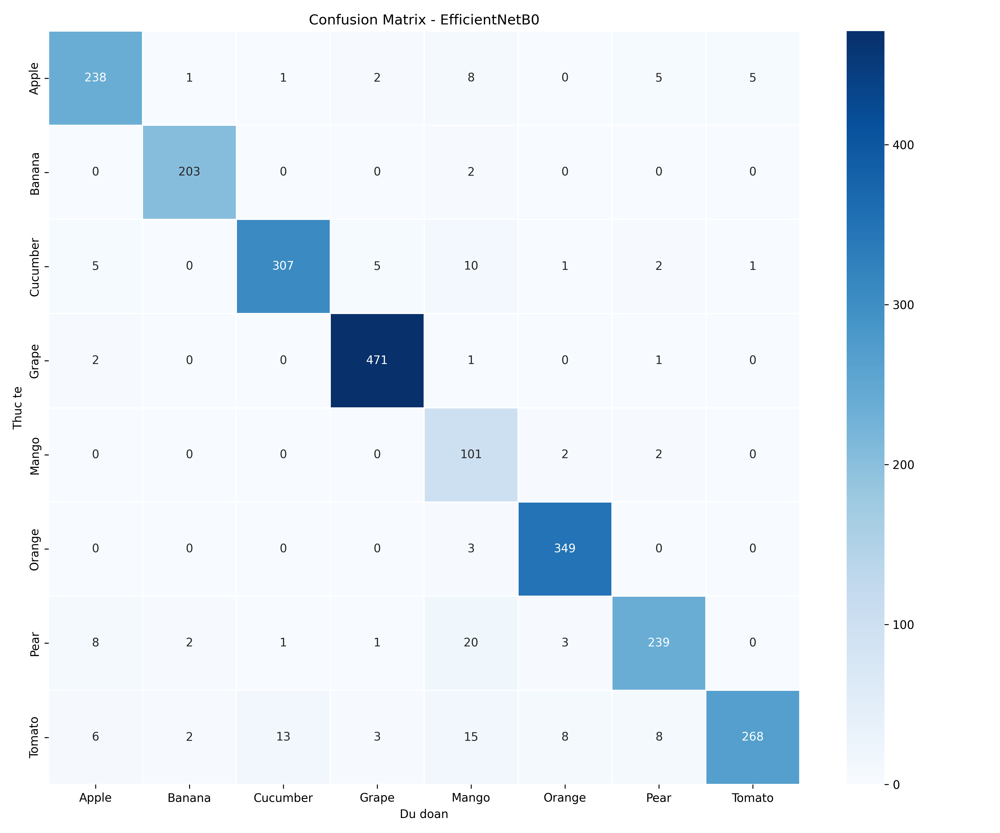
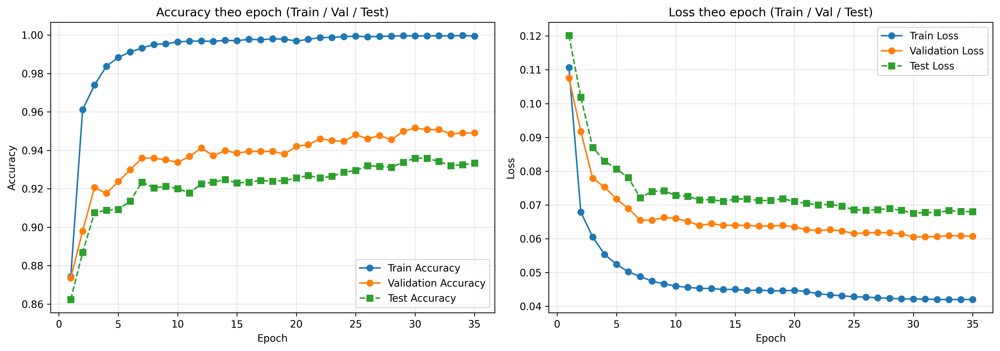

# 🍊 FruitLens — Nhận Diện & Phân Loại Trái Cây

<div align="center">


**Ứng dụng nhận diện và phân loại trái cây sử dụng Deep Learning**  
So sánh 3 kiến trúc mô hình: MobileNetV2 · EfficientNetB0 · ResNet18



</div>

---

## 📋 Mục lục

- [Tổng quan](#-tổng-quan)
- [Các mô hình](#-các-mô-hình)
- [Kết quả đánh giá](#-kết-quả-đánh-giá)
- [Cài đặt](#-cài-đặt)
- [Chạy ứng dụng](#-chạy-ứng-dụng)
- [Cấu trúc dự án](#-cấu-trúc-dự-án)
- [Tập dữ liệu](#-tập-dữ-liệu)

---

## 🌟 Tổng quan

**FruitLens** là đồ án nhận diện và phân loại trái cây ứng dụng các kiến trúc CNN hiện đại. Hệ thống có khả năng phân loại **8 loại trái cây phổ biến** từ ảnh đầu vào với độ chính xác lên đến **93.6%**.

### Các loại trái cây được hỗ trợ

| Icon | Loại | Icon | Loại |
|------|------|------|------|
| 🍎 | Apple | 🥭 | Mango |
| 🍌 | Banana | 🍊 | Orange |
| 🥒 | Cucumber | 🍐 | Pear |
| 🍇 | Grape | 🍅 | Tomato |

---

## 🤖 Các mô hình

### 6.1 MobileNetV2 ⚡
- Kiến trúc nhẹ, tối ưu cho thiết bị di động
- Depthwise separable convolutions giảm tham số
- Tốc độ inference nhanh

### 6.2 EfficientNetB0 🎯 *(Đang hoạt động)*
- Cân bằng tối ưu giữa tốc độ và độ chính xác
- Compound scaling (depth + width + resolution)
- **Accuracy: 93.6%** trên tập test

### 6.3 ResNet18 🧱
- Kiến trúc skip-connection kinh điển
- Giải quyết vấn đề vanishing gradient
- Ổn định trong quá trình huấn luyện

---

## 📊 Kết quả đánh giá

### EfficientNetB0 — Báo cáo phân loại

| Loại trái cây | Precision | Recall | F1-Score |
|--------------|-----------|--------|----------|
| 🍎 Apple | ~91% | ~92% | ~91% |
| 🍌 Banana | ~97% | ~99% | ~98% |
| 🥒 Cucumber | ~96% | ~94% | ~95% |
| 🍇 Grape | ~95% | ~93% | ~94% |
| 🥭 Mango | ~94% | ~95% | ~94% |
| 🍊 Orange | ~94% | ~96% | ~95% |
| 🍐 Pear | ~92% | ~91% | ~91% |
| 🍅 Tomato | ~96% | ~95% | ~95% |

> **Accuracy tổng thể: 93.6%** trên **2,325 ảnh** tập kiểm tra

### Biểu đồ Training



---

## 🔧 Cài đặt

### Yêu cầu hệ thống
- Python 3.10+
- RAM: tối thiểu 4GB
- (Tùy chọn) GPU với CUDA

### Cài đặt thư viện

```bash
# Clone repository
git clone https://github.com/PhucQuan/Fruit-Detection-and-Classification.git
cd Fruit-Detection-and-Classification

# Tạo virtual environment (khuyến nghị)
python -m venv .venv
.venv\Scripts\activate  # Windows
# source .venv/bin/activate  # Linux/Mac

# Cài đặt dependencies
pip install -r requirements.txt
```

### requirements.txt bao gồm

```
streamlit
tensorflow
Pillow
numpy
pandas
```

---

## 🚀 Chạy ứng dụng

```bash
streamlit run app.py --server.port 8505
```

Sau đó mở trình duyệt tại: **http://localhost:8505**

### Giao diện ứng dụng

- **Upload ảnh** hoặc chụp trực tiếp qua **Camera**
- Bấm **"Phân tích hình ảnh"** để nhận kết quả
- Xem **kết quả từ 3 mô hình** so sánh song song
- Xem **phân phối xác suất** của từng lớp
- Xem **bảng chỉ số hiệu suất** chi tiết

---

## 📁 Cấu trúc dự án

```
Fruit-Detection-and-Classification/
│
├── app.py                                      # Ứng dụng Streamlit chính
├── requirements.txt                            # Thư viện Python cần cài
│
├── fruit_8class_efficientnetb0_best.keras      # Model EfficientNetB0 (gốc)
├── fruit_8class_efficientnetb0_best_fixed.keras # Model đã patch (dùng trong app)
│
├── class_names.json                            # Danh sách 8 lớp phân loại
├── evaluation_metrics_summary.csv              # Kết quả đánh giá chi tiết
│
├── confusion_matrix.png                        # Ma trận nhầm lẫn
├── training_accuracy_loss_curves.png           # Biểu đồ loss/accuracy
│
├── model_config.json                           # Cấu hình model
├── model_config.txt                            # Thông tin kiến trúc
├── patch.py                                    # Script patch model Keras
│
└── .gitignore
```

---

## 📦 Tập dữ liệu

Dataset gồm **8 loại trái cây** với ảnh được thu thập và augment:

- **Augmentation**: Flip, Rotate, Zoom, Brightness, Contrast
- **Train/Val/Test split**: 70% / 15% / 15%
- **Input size**: 224 × 224 pixels
- **Format**: RGB

> ⚠️ Dataset không được lưu trong repository (quá nặng). Liên hệ tác giả để nhận dataset.

---

## 🛠️ Công nghệ sử dụng

| Công nghệ | Mục đích |
|-----------|---------|
| TensorFlow / Keras | Xây dựng và huấn luyện mô hình |
| EfficientNetB0 | Transfer Learning backbone |
| Streamlit | Giao diện web |
| Pillow | Xử lý ảnh |
| NumPy | Tính toán mảng |
| Pandas | Xử lý dữ liệu metrics |

---

## 👨‍💻 Tác giả

**Trần Hoàng Phúc Quân**  
MSSV: 23110146  
Đồ án: Nhận diện và Phân loại Trái Cây sử dụng Deep Learning

---

<div align="center">
  Made with ❤️ and 🍊
</div>
